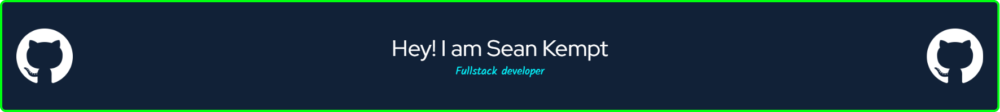

- 🔭 I’m currently working on improving my portfolio and gaining more experience as a Full Stack Developer
- 🌱 I’m currently learning React and NodeJS
- 📫 How to reach me: Kempt101@gmail.com
- ⚡ Fun fact: I love training Brazilian Jiu-Jitsu!

<!--
**SeanKempt/SeanKempt** is a ✨ _special_ ✨ repository because its `README.md` (this file) appears on your GitHub profile.

Here are some ideas to get you started:

-->
